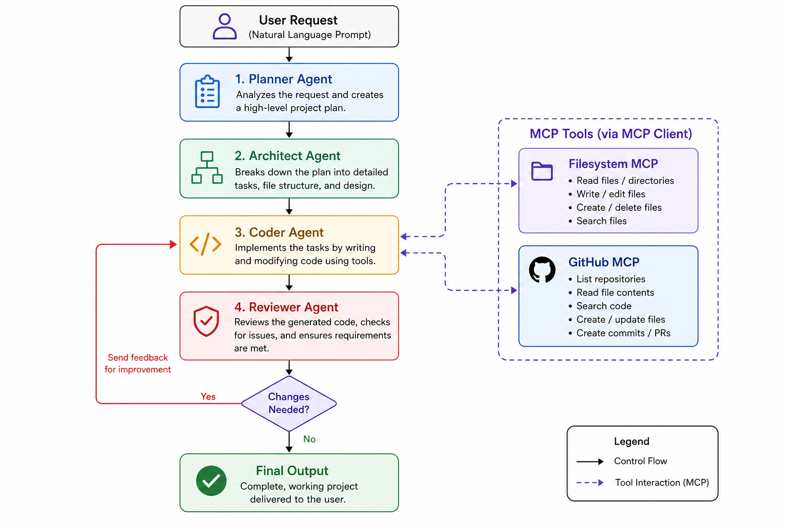

# AI-Coding-Assistant

**AI-Coding-Assistant** is an AI-powered, multi-agent development tool built with [LangGraph](https://github.com/langchain-ai/langgraph) and real MCP servers.

It functions as an autonomous development team, transforming natural language requests into complete, working software projects. By mirroring real-world development workflows, the assistant plans, architects, implements, reviews, and repairs code file-by-file.

---

## Architecture

The system operates using a multi-agent workflow, where each agent is responsible for a specific phase of the software development lifecycle.

```text
User Prompt
  -> Planner Agent
  -> Architect Agent
  -> Coder Agent
       -> MCP Client Adapter
            -> Filesystem MCP Server
            -> GitHub MCP Server
  -> Reviewer Agent
       -> Coder Agent if fixes needed
  -> Final Project Output
```

### Planner Agent

Analyzes the user's request and generates a comprehensive high-level project plan.

### Architect Agent

Breaks down the project plan into granular engineering tasks, defining file structures, dependencies, and implementation details.

### Coder Agent

Implements the assigned tasks with tools loaded from real MCP servers. Each prompt gets a unique output folder under `generated_projects`, the Filesystem MCP server is scoped to that folder, and the GitHub MCP server can inspect repositories and GitHub context through GitHub's official local server.

### MCP Client Adapter

Uses `langchain-mcp-adapters` to connect LangGraph/LangChain agents to real MCP servers and convert server tools into agent-callable tools. The coder uses dynamic tool selection: Filesystem MCP is loaded for normal project generation, and GitHub MCP is added when the prompt or review feedback needs repository context.

### Reviewer Agent

Checks the generated project for requirements coverage, obvious bugs, missing files, integration issues, and code quality. If fixes are needed, the reviewer routes feedback back to the coder before the workflow completes.

<div align="center">
    
</div>

---

## Getting Started

Follow the steps below to set up and run the AI-Coding-Assistant on your local machine.

### Prerequisites

#### UV Package Manager

This project uses `uv` for fast Python environment and dependency management.

Installation guide:

https://docs.astral.sh/uv/getting-started/installation/

#### Groq API Key

A Groq API key is required to power the LLM agents.

#### Docker

Docker is required for GitHub's official local MCP server:

```bash
docker pull ghcr.io/github/github-mcp-server
```

#### Node.js and npm

Node.js/npm are required because the Filesystem MCP server runs through `npx`:

```bash
npx -y @modelcontextprotocol/server-filesystem ./generated_projects/<project-folder>
```

---

## Installation and Setup

### 1. Create and Activate a Virtual Environment

Linux/macOS:

```bash
uv venv
source .venv/bin/activate
```

Windows:

```bash
uv venv
.venv\Scripts\activate
```

### 2. Install Project Dependencies

```bash
uv pip install -r pyproject.toml
```

### 3. Configure Environment Variables

Create a `.env` file in the project root and add the required environment variables.

```bash
cp .sample_env .env
```

Example:

```env
GROQ_API_KEY=your_groq_api_key
GITHUB_PERSONAL_ACCESS_TOKEN=your_github_personal_access_token
```

`GITHUB_PERSONAL_ACCESS_TOKEN` is optional for local file-only generation, but required to load the GitHub MCP server. If MCP startup fails, the app falls back to local debug tools so development can continue.

---

## Usage

After completing the setup, start the application with:

```bash
python main.py
```

---

## Example Prompts

### To-Do Application

```text
Create a to-do list application using HTML, CSS, and vanilla JavaScript.
```

### Calculator Application

```text
Build a simple calculator web application.
```

### FastAPI Blog API

```text
Create a simple blog API in FastAPI with a SQLite database.
```

---

## Project Workflow

1. The Planner Agent analyzes the request and creates a project plan.
2. The Architect Agent converts the plan into detailed engineering tasks.
3. A unique project folder is created under `generated_projects`.
4. The Coder Agent loads real MCP tools scoped to that project folder and generates files.
5. The Reviewer Agent checks the output and requests fixes if needed.
6. The Coder Agent applies reviewer fixes until approved or the retry cap is reached.
7. The completed project is assembled and returned to the user.

---